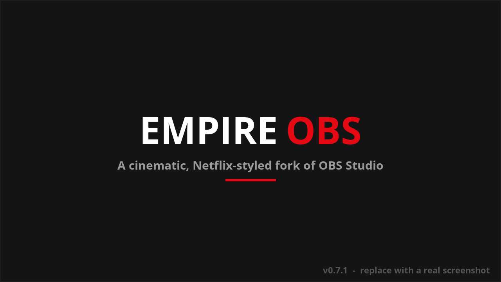
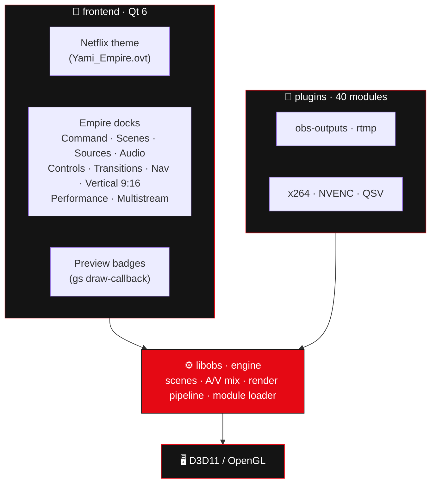
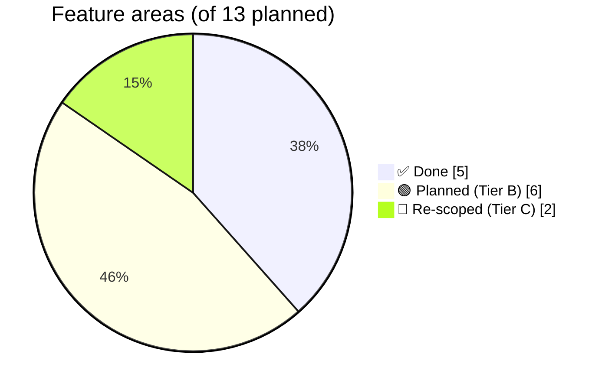

<div align="center">


# 🎬 EMPIRE‑OBS

### ⟶ *A cinematic, Netflix‑styled fork of OBS Studio* ⟵

**Dark · red · modern.** Built‑in **multistreaming**, creator tools, and a bleeding‑edge toolchain.

<br/>


</div>

---

> [!NOTE]
> **Empire‑OBS** is a personal, modernized fork of [OBS Studio](https://github.com/obsproject/obs-studio) (GPL‑2.0).
> It rebuilds the entire interface in a cinematic **Netflix palette** (`#141414` / `#E50914`) — a top **Command bar**,
> seamless **Scenes · Sources · Audio · Controls** cards, a right **navigation rail**, **status badges over the preview**,
> a full **Vertical 9:16** studio, **multistreaming**, live **performance** graphs, ready‑made **scene templates** and a
> **Smart Setup** assistant — all on the latest upstream OBS, compiled on the newest **Visual Studio 2026** toolchain.

## 📑 Table of Contents

- [✨ Features](#-features)
- [🖼️ Screenshots](#️-screenshots)
- [🖼️ Look &amp; feel](#️-look--feel)
- [🏗️ Architecture](#️-architecture)
- [🧱 Tech stack](#-tech-stack)
- [📊 Progress](#-progress)
- [🗺️ Roadmap](#️-roadmap)
- [🚀 Build from source](#-build-from-source)
- [📦 Changelog](#-changelog)
- [🔒 Security](#-security)
- [🤝 Contributing](#-contributing)
- [📄 License](#-license)

---

## ✨ Features

| | Feature | Description | Status |
|:--:|---|---|:--:|
| 🎬 | **Cinematic UI rebuild** | A full Empire layout — top **Command bar**, a bottom row of **Scenes · Sources · Audio · Controls** cards, and a right **navigation rail** — over the bold **Empire Modern** theme (default), with seamless card headers | ✅ |
| 🟥 | **Preview badges** | **LIVE / REC** · resolution · scene name drawn right over the program preview | ✅ |
| 📐 | **Vertical 9:16** | A portrait canvas you can **preview · compose** (drag / scale / add sources) · **record · stream** — toggled in one click from the top bar | ✅ |
| 🎚️ | **Empire Audio** | Per‑source faders with **live VU meters** + a **dB** readout + mute | ✅ |
| 🎞️ | **Scenes &amp; Sources cards** | One‑click scene switch (**+ new / rename / duplicate / remove**) and source visibility (**+ add / properties / filters / remove**) | ✅ |
| 🔀 | **Transitions panel** | Pick the active scene transition and its duration | ✅ |
| 📡 | **Multistreaming** | Stream to **multiple RTMP destinations at once** (Twitch + YouTube + Kick + …), sharing the main encoders — no extra GPU/CPU | ✅ |
| 📈 | **Performance dock** | Live graphs: CPU · FPS · render · dropped frames · bitrate, with a **stream‑health** banner | ✅ |
| 🧠 | **Templates + Smart Setup** | Ready‑made scene collections + a detected‑hardware summary in the auto‑config wizard | ✅ |

> 📡 **Multistream highlight:** one encode pass → many uploads. Manage up to **3 extra destinations** from a
> dock with per‑target **LIVE / failed** status and a one‑click **Start all streams** button.

---

## 🖼️ Screenshots

<div align="center">



*Command bar (with the one‑click **9:16** toggle) · **status badges over the preview** · seamless **Scenes · Sources · Audio · Controls** cards · the right **navigation rail**.*

</div>

> 📸 More shots — the Vertical 9:16 studio, live VU meters and the accent themes — live in the **[Wiki → Features](wiki/Features.md)**.

---

## 🖼️ Look &amp; feel

```
┌───────────────────────────────────────────────────────────┐
│  ●  EMPIRE‑OBS            #141414 background · #E50914 red  │
│                                                            │
│  ▸ Scenes      ▸ Sources       ┌─ Empire Performance ───┐  │
│  ▸ Audio Mixer ▸ Transitions   │  CPU   ▁▂▅▇▅▃  23 (max 78)│
│                                │  FPS   ▇▇▇▇▇▇  60         │
│  ┌─ Empire Multistream ─────┐  │  RAM   ▃▃▄▄▄▅  812 MB     │
│  │ ☑ YouTube   ● LIVE       │  └────────────────────────┘  │
│  │ ☑ Kick      ● LIVE       │   [ ⬤  Start all streams ]   │
│  └──────────────────────────┘                              │
└───────────────────────────────────────────────────────────┘
```

---

## 🏗️ Architecture



**Design rule:** ~90% of Empire features live in the **frontend** and **data** layers (docks, theme, templates)
or as **scripts** — the core `libobs` engine stays untouched, so syncing with upstream OBS stays painless.

---

## 🧱 Tech stack

| Layer | Technology | Version |
|---|---|---|
| Base | OBS Studio | `master` (≥ 32.1.2) |
| Engine | C | C17 |
| UI | C++ · **Qt 6** | C++17/20 · Qt 6.8 LTS |
| Browser source | CEF | 6533 (Chromium 127) |
| Build | **CMake** + Presets | 4.3.x · schema v8 |
| Compiler | **MSVC** (Visual Studio 2026) | v14.51 |
| Windows SDK | target | 10.0.26100 |
| Scripting | Lua · Python | bundled · 3.x |
| CI | GitHub Actions | — |

---

## 📊 Progress

Of the 13 originally planned feature areas:



| Area | Progress |
|---|---|
| 🎨 Theme &amp; UI | `██████████` 98% |
| 📡 Multistreaming | `█████████░` 90% |
| 🛠️ Creator tools | `████████░░` 85% |
| 🧠 AI &amp; automation | `█░░░░░░░░░` 10% |
| 🔌 IoT &amp; devices | `░░░░░░░░░░` 0% |
| 📚 Docs &amp; CI | `█████████░` 90% |

---

## 🗺️ Roadmap

See **[ROADMAP.md](ROADMAP.md)** for the full plan. Highlights:

- ✅ **Shipped:** cinematic UI rebuild · Vertical 9:16 studio · preview badges · right nav rail · multistream · scene templates
- 🟢 **Next:** AI background removal (ONNX plugin) · per‑destination multistream tuning · more accent themes
- 🟡 **Later:** IoT lights (Hue/Govee) · chat overlay · cloud recording · mobile companion
- 🔴 **Re‑scoped:** FSR/DLSS/VR (#4) and Plugin Framework 2.0 (#9) — see roadmap for the feasible kernels

---

## 🚀 Build from source

> [!IMPORTANT]
> Requires **Visual Studio 2026 Build Tools** (workload *Desktop development with C++* / MSVC) and **CMake ≥ 4.3**.
> Build **outside** OneDrive‑synced folders.

```powershell
# 1. Clone with submodules
git clone --recursive https://github.com/Gh0s777tt/empire-OBS.git C:\dev\empire-OBS
cd C:\dev\empire-OBS

# 2. Configure (auto-downloads Qt6 + CEF + obs-deps, ~8 min)
cmake --preset empire-windows-x64

# 3. Build (SERIAL — do NOT use --parallel; it races the nested x86 virtualcam sub-build)
cmake --build --preset empire-windows-x64

# 4. Run (portable = isolated config)
.\build_x64\rundir\RelWithDebInfo\bin\64bit\obs64.exe --portable
```

📖 Full build notes, gotchas and the VS‑2026 fixes are in the **[Wiki → Building](wiki/Building.md)**.

---

## 📦 Changelog

All notable changes are tracked in **[CHANGELOG.md](CHANGELOG.md)** with numbered updates.
Latest: **`v0.7.1` — Cinematic Polish** *(Update #012)*.

---

## 🔒 Security

The repository is **public** (GPL‑2.0) and hardened:

- 🛡️ **Branch protection** on `empire/main` (no force‑push, no deletion, linear history)
- 🤖 **Dependabot** vulnerability alerts + automated security fixes
- 🔁 **Inherited upstream CI** (Push / Scheduled) is fork‑guarded, so release tags stay green
- 🔑 Secret‑scanning push protection (where available on the plan)

Report vulnerabilities privately — see **[Wiki → Security](wiki/Security.md)**.

---

## 🤝 Contributing

This is a personal fork, but the workflow is PR‑based:

1. Branch from `empire/main` → `feature/your-feature`
2. Keep changes in the **frontend / data / scripts** layers where possible (sync‑friendly)
3. Update **README · CHANGELOG · ROADMAP** as part of the change
4. Open a Pull Request

---

## 📄 License

Empire‑OBS is distributed under the **GNU General Public License v2.0 (or later)** — see [COPYING](COPYING).
It is a fork of [OBS Studio](https://github.com/obsproject/obs-studio) © the OBS Project contributors.

<div align="center">

<br/>

**▰▰▰▰▰▰▰▰▰▰▰▰▰▰▰▰▰▰▰▰▰▰▰▰▰▰▰▰**

*Made with 🎬 + ☕ — Empire‑OBS*

</div>
