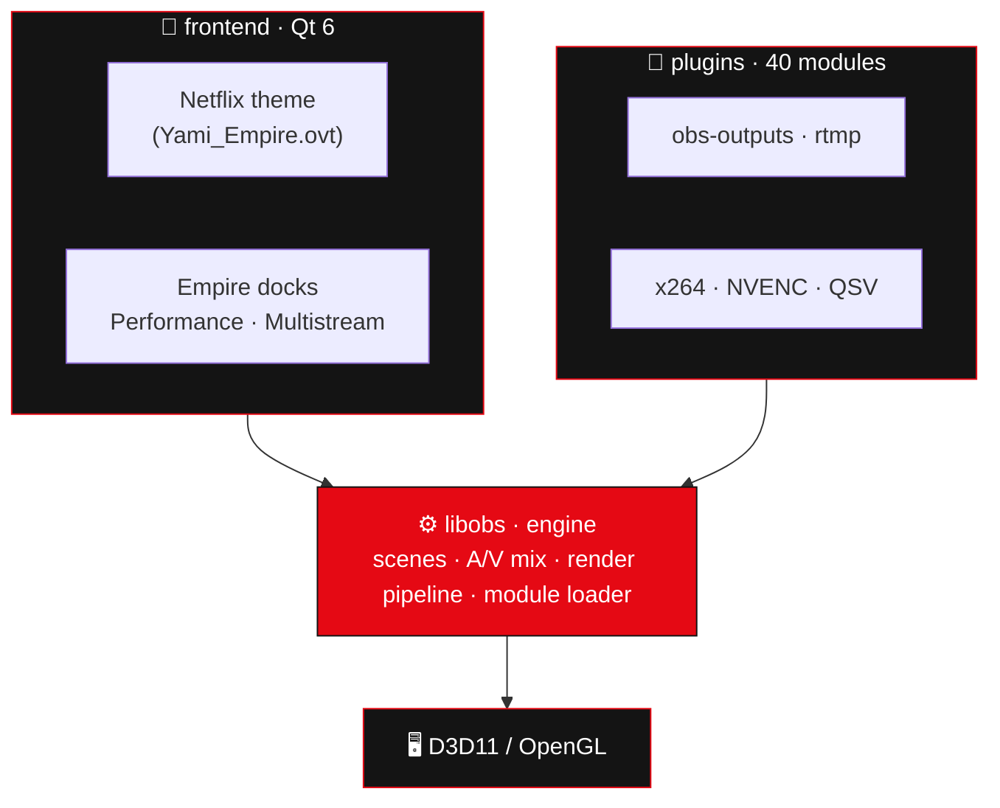
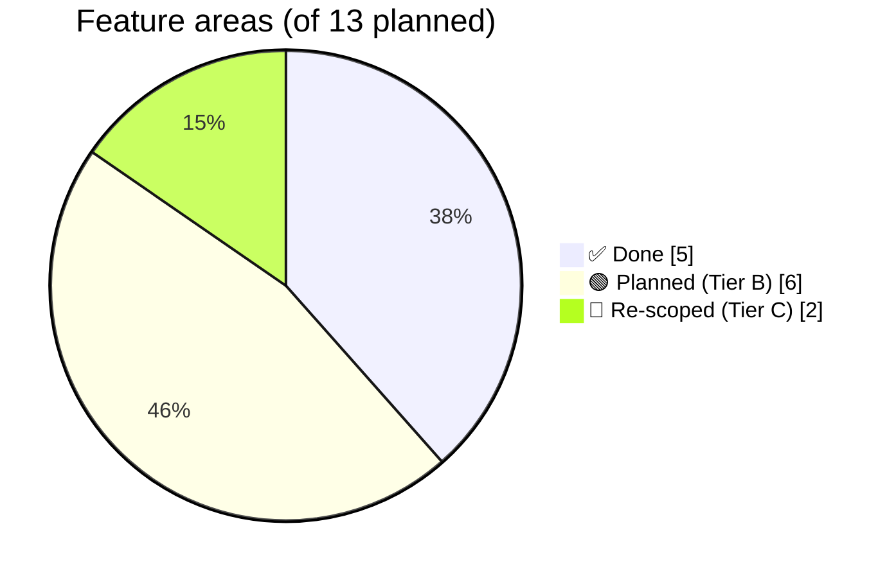

<div align="center">


# 🎬 EMPIRE‑OBS

### ⟶ *A cinematic, Netflix‑styled fork of OBS Studio* ⟵

**Dark · red · modern.** Built‑in **multistreaming**, creator tools, and a bleeding‑edge toolchain.

<br/>


</div>

---

> [!NOTE]
> **Empire‑OBS** is a personal, modernized fork of [OBS Studio](https://github.com/obsproject/obs-studio) (GPL‑2.0).
> It re‑skins the entire interface in a cinematic **Netflix palette** (`#141414` / `#E50914`), adds native
> **performance** and **multistreaming** docks, ready‑made **scene templates**, and a **Smart Setup** assistant —
> all building on the latest upstream OBS, compiled on the newest **Visual Studio 2026** toolchain.

## 📑 Table of Contents

- [✨ Features](#-features)
- [🖼️ Look &amp; feel](#️-look--feel)
- [🏗️ Architecture](#️-architecture)
- [🧱 Tech stack](#-tech-stack)
- [📊 Progress](#-progress)
- [🗺️ Roadmap](#️-roadmap)
- [🚀 Build from source](#-build-from-source)
- [📦 Changelog](#-changelog)
- [🔒 Security](#-security)
- [🤝 Contributing](#-contributing)
- [📄 License](#-license)

---

## ✨ Features

| | Feature | Description | Status |
|:--:|---|---|:--:|
| 🎨 | **Netflix Cinematic Theme** | Full dark UI in `#141414` + `#E50914`, rounded corners, red LIVE state — set as the default theme | ✅ |
| 📈 | **Empire Performance dock** | Live custom‑painted graphs: CPU · FPS · render time · missed frames · RAM, with peak (max) readout | ✅ |
| 🎞️ | **Scene Templates** | Ready‑made scene collections — *Gaming*, *Just Chatting*, *Podcast* | ✅ |
| 🧠 | **Smart Setup** | Detected‑hardware summary (CPU cores + encoders) inside the auto‑config wizard | ✅ |
| 📡 | **Multistreaming** | Stream to **multiple RTMP destinations at once** (Twitch + YouTube + Kick + …) — native dock **and** Lua script, sharing the main encoders (no extra GPU/CPU) | ✅ |

> 📡 **Multistream highlight:** one encode pass → many uploads. Manage up to **3 extra destinations** from a
> dock with per‑target **LIVE / failed** status and a one‑click **Start all streams** button.

---

## 🖼️ Look &amp; feel

```
┌───────────────────────────────────────────────────────────┐
│  ●  EMPIRE‑OBS            #141414 background · #E50914 red  │
│                                                            │
│  ▸ Scenes      ▸ Sources       ┌─ Empire Performance ───┐  │
│  ▸ Audio Mixer ▸ Transitions   │  CPU   ▁▂▅▇▅▃  23 (max 78)│
│                                │  FPS   ▇▇▇▇▇▇  60         │
│  ┌─ Empire Multistream ─────┐  │  RAM   ▃▃▄▄▄▅  812 MB     │
│  │ ☑ YouTube   ● LIVE       │  └────────────────────────┘  │
│  │ ☑ Kick      ● LIVE       │   [ ⬤  Start all streams ]   │
│  └──────────────────────────┘                              │
└───────────────────────────────────────────────────────────┘
```

---

## 🏗️ Architecture



**Design rule:** ~90% of Empire features live in the **frontend** and **data** layers (docks, theme, templates)
or as **scripts** — the core `libobs` engine stays untouched, so syncing with upstream OBS stays painless.

---

## 🧱 Tech stack

| Layer | Technology | Version |
|---|---|---|
| Base | OBS Studio | `master` (≥ 32.1.2) |
| Engine | C | C17 |
| UI | C++ · **Qt 6** | C++17/20 · Qt 6.8 LTS |
| Browser source | CEF | 6533 (Chromium 127) |
| Build | **CMake** + Presets | 4.3.x · schema v8 |
| Compiler | **MSVC** (Visual Studio 2026) | v14.51 |
| Windows SDK | target | 10.0.26100 |
| Scripting | Lua · Python | bundled · 3.x |
| CI | GitHub Actions | — |

---

## 📊 Progress

Of the 13 originally planned feature areas:



| Area | Progress |
|---|---|
| 🎨 Theme &amp; UI | `████████░░` 80% |
| 📡 Multistreaming | `█████████░` 90% |
| 🛠️ Creator tools | `██████░░░░` 60% |
| 🧠 AI &amp; automation | `█░░░░░░░░░` 10% |
| 🔌 IoT &amp; devices | `░░░░░░░░░░` 0% |
| 📚 Docs &amp; CI | `███████░░░` 70% |

---

## 🗺️ Roadmap

See **[ROADMAP.md](ROADMAP.md)** for the full plan. Highlights:

- 🟢 **Next:** Vertical 9:16 mode · AI background removal (ONNX) · scene‑template auto‑install · multistream v2 (per‑destination settings)
- 🟡 **Later:** IoT lights (Hue/Govee) · chat overlay · cloud recording · mobile companion
- 🔴 **Re‑scoped:** FSR/DLSS/VR (#4) and Plugin Framework 2.0 (#9) — see roadmap for the feasible kernels

---

## 🚀 Build from source

> [!IMPORTANT]
> Requires **Visual Studio 2026 Build Tools** (workload *Desktop development with C++* / MSVC) and **CMake ≥ 4.3**.
> Build **outside** OneDrive‑synced folders.

```powershell
# 1. Clone with submodules
git clone --recursive https://github.com/Gh0s777tt/empire-OBS.git C:\dev\empire-OBS
cd C:\dev\empire-OBS

# 2. Configure (auto-downloads Qt6 + CEF + obs-deps, ~8 min)
cmake --preset empire-windows-x64

# 3. Build (SERIAL — do NOT use --parallel; it races the nested x86 virtualcam sub-build)
cmake --build --preset empire-windows-x64

# 4. Run (portable = isolated config)
.\build_x64\rundir\RelWithDebInfo\bin\64bit\obs64.exe --portable
```

📖 Full build notes, gotchas and the VS‑2026 fixes are in the **[Wiki → Building](https://github.com/Gh0s777tt/empire-OBS/wiki/Building)**.

---

## 📦 Changelog

All notable changes are tracked in **[CHANGELOG.md](CHANGELOG.md)** with numbered updates.
Latest: **`v0.3.0` — Multistream** *(Update #004)*.

---

## 🔒 Security

This is a **private** repository hardened against unauthorized changes:

- 🛡️ **Branch protection** on `empire/main` (no force‑push, no deletion, linear history)
- 🤖 **Dependabot** vulnerability alerts + automated security fixes
- 🔑 **Secret‑scanning push protection** (where available on the plan)
- 🔐 Private visibility · forking restricted

Report vulnerabilities privately — see **[Wiki → Security](https://github.com/Gh0s777tt/empire-OBS/wiki/Security)**.

---

## 🤝 Contributing

This is a personal fork, but the workflow is PR‑based:

1. Branch from `empire/main` → `feature/your-feature`
2. Keep changes in the **frontend / data / scripts** layers where possible (sync‑friendly)
3. Update **README · CHANGELOG · ROADMAP** as part of the change
4. Open a Pull Request

---

## 📄 License

Empire‑OBS is distributed under the **GNU General Public License v2.0 (or later)** — see [COPYING](COPYING).
It is a fork of [OBS Studio](https://github.com/obsproject/obs-studio) © the OBS Project contributors.

<div align="center">

<br/>

**▰▰▰▰▰▰▰▰▰▰▰▰▰▰▰▰▰▰▰▰▰▰▰▰▰▰▰▰**

*Made with 🎬 + ☕ — Empire‑OBS*

</div>
