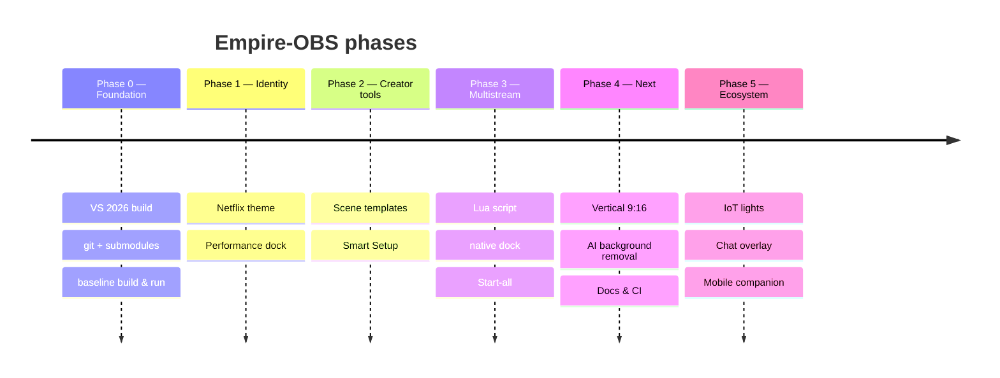

# 🗺️ Empire‑OBS Roadmap

> Living document — updated with every release. Maps the original 13‑point vision to a realistic plan.
> Legend: ✅ done · 🟢 planned (feasible) · 🟡 later · 🔴 re‑scoped (not feasible as originally stated).

---

## 🧭 Phases

---

## ✅ Done (Phases 0–3)

| # | Feature | Release |
|:--:|---|:--:|
| — | VS 2026 toolchain, git, submodules, baseline build+run | `v0.1.0` |
| #1 | Netflix Cinematic theme (default) | `v0.1.0` |
| #8 | Empire Performance dock (+ peak) | `v0.1.0` / `v0.1.1` |
| #11 | Scene templates | `v0.2.0` |
| #13 | Smart Setup (hardware summary) | `v0.2.0` |
| #3 | Multistreaming (script + native dock + Start‑all) | `v0.3.0` |

---

## 🟢 Tier B — planned, feasible (next sessions)

| # | What remains | Effort* |
|:--:|---|:--:|
| #2 | Collapsible/auto‑hide docks · quick‑scene‑switcher toolbar · cinematic preview frame · card dialogs | `M–L` |
| #5 | AI background removal (ONNX) · auto scene switcher · live captions · sensitive‑data blur · auto game detect | `L` |
| #6 | **Vertical 9:16** · cloud recording · chat overlay · hotkey profiles · Replay Buffer 2.0 | `M–L` |
| #7 | Stream Deck · Hue/Govee/Nanoleaf · Razer/Corsair · USB/BT discovery | `L` |
| #8+ | Stream‑health dashboard: dropped frames · bitrate · RTT · jitter | `M` |
| #10 | MkDocs site (dark) · fork CI (auto‑build installer) · Polish docs | `S–M` |
| #11+ | Scene folders · versioning · quick switcher · template auto‑install | `S–M` |
| #12 | Mobile companion (iOS/Android) — *websocket backend already exists in OBS* | `XL` |

*S = hours · M = days · L = a week+ · XL = months

---

## 🔴 Tier C — re‑scoped (not feasible as originally stated)

| # | Original ask | Reality &amp; feasible kernel |
|:--:|---|---|
| #4 | FSR/DLSS/VR‑AR‑MR rendering | Wrong model — DLSS/FSR need game‑engine motion vectors; OBS composites finished frames. **Feasible kernel:** Smart Encoder auto‑select (`M`); AV1 + HW encoders **already in OBS**. |
| #9 | Plugin Framework 2.0 (hot‑reload · WASM · Rust/Go · in‑app store) | Multi‑year, multi‑person redesign of the module system. **Feasible kernel:** better plugin template + docs; Rust plugins already possible via the C ABI. |

---

## 🧹 Fork hygiene (quick, high‑value)

- [ ] Auto‑install scene templates for all users — `S`
- [ ] Multistream **v2**: independent per‑destination encoder settings — `M`
- [ ] Full rebrand: product name · icons · installer “Empire” — `S–M`
- [ ] CI workflow building an `empire-OBS` installer on every push — `M`

---

## ✅ Already in upstream OBS (extend, don't rebuild)

`noise suppression` · `websocket remote control` · `auto‑config wizard` · `dynamic bitrate` · `scene groups` · `replay buffer` · `AV1 + hardware encoders`

---

**~40% shipped · ~40% planned · ~20% re‑scoped**

