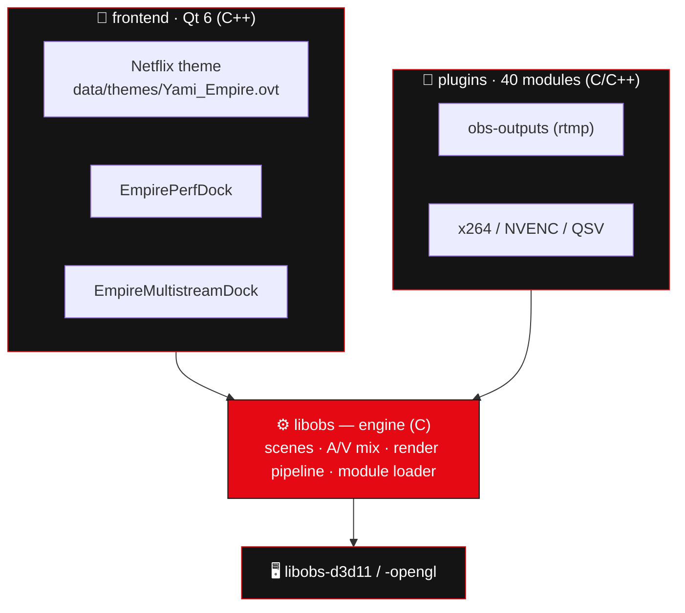

# 🧩 Architecture

Empire‑OBS follows OBS Studio's layered design. The golden rule: **keep changes in the upper layers**
(frontend, data, scripts) so syncing with upstream stays painless.



---

## 🗂️ Where Empire changes live

| Empire feature | File(s) | Layer |
|---|---|---|
| 🎨 Netflix theme | `frontend/data/themes/Yami_Empire.ovt` | **data** (zero compile) |
| 🎨 Default theme | `frontend/cmake/templates/ui-config.h.in` → `DEFAULT_THEME` | build |
| 📈 Performance dock | `frontend/widgets/EmpirePerfDock.{hpp,cpp}` | frontend |
| 📡 Multistream dock | `frontend/widgets/EmpireMultistreamDock.{hpp,cpp}` | frontend |
| 📡 Multistream script | `empire-scripts/empire-multistream.lua` | **script** (zero compile) |
| 🧠 Smart Setup | `frontend/wizards/AutoConfigTestPage.cpp` | frontend |
| 🎞️ Scene templates | `templates/*.json` | **data** |
| 🔧 Dock registration | `frontend/widgets/OBSBasic.cpp` → `OnFirstLoad()` | frontend |
| 🔧 Source list | `frontend/cmake/ui-widgets.cmake` | build |

---

## 🧠 Core concepts (libobs)

OBS is built around six object types — Empire features mostly *consume* these rather than change them:

| Object | Role |
|---|---|
| **Source** | image/audio input (capture, media, browser) |
| **Filter** | processes a source |
| **Transition** | scene‑to‑scene effect |
| **Encoder** | compresses A/V (x264, NVENC, QSV) — **shareable across outputs** (this is how multistream reuses one encode) |
| **Output** | where the stream/recording goes (RTMP, FFmpeg) |
| **Service** | platform config (URL + key) |

> 💡 **Multistream** creates extra `obs_output_t` + `obs_service_t` objects that **share** the main stream's
> encoders via `obs_output_set_video_encoder()` — one encode pass, many uploads.

---

## 🧩 Docks

Empire docks register through the public frontend API so they get an automatic *View → Docks* entry and
state persistence:

```cpp
obs_frontend_add_dock_by_id("empire_perf_dock", "Empire Performance", new EmpirePerfDock());
obs_frontend_add_dock_by_id("empire_multistream_dock", "Empire Multistream", new EmpireMultistreamDock());
```

> ℹ️ Graphs are **custom‑painted** (`QPainter`) because the obs‑deps Qt6 bundle ships **without** the Qt Charts
> module — keeping the docks dependency‑free.
