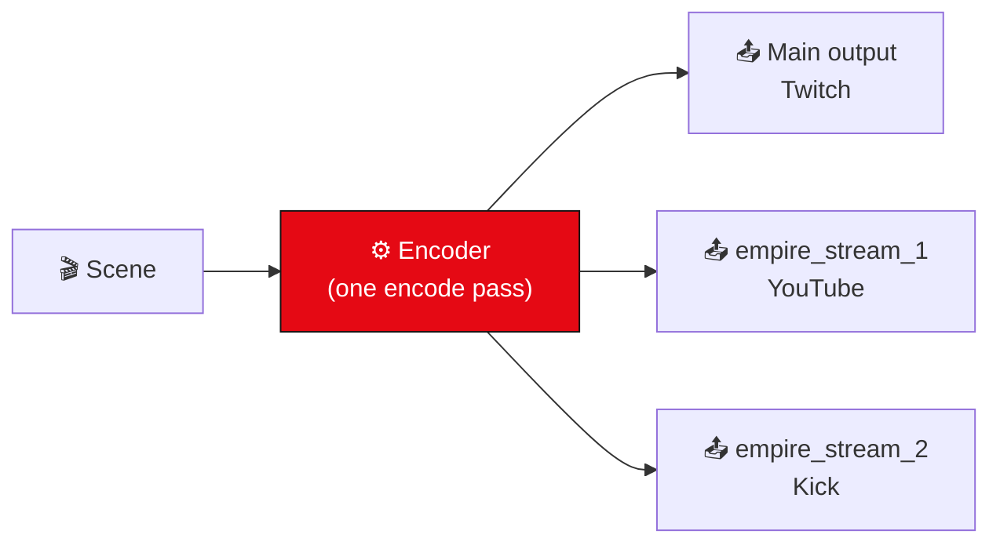

# 📡 Multistreaming

Stream to **multiple RTMP destinations at the same time** (e.g. Twitch + YouTube + Kick + Facebook).
Every extra destination **reuses the main stream's encoders** — one encode pass, multiple uploads, so there is
**no extra GPU/CPU cost**, only additional network upload.

Two ways to use it: a **native dock** (recommended) or a **Lua script**.

---

## 🅰️ Native dock (recommended)

1. **View → Docks → Empire Multistream**
2. For each destination: tick **Enable**, paste the **RTMP URL** + **stream key**
3. *(optional)* set a **kb/s** value to give that destination its **own bitrate** — leave it blank to share the main encoder
4. Configure your **main** stream as usual (Settings → Stream)
5. Click **Start all streams** (or just Start Streaming) — every enabled destination goes **LIVE**

Per‑destination status shows **LIVE / failed / skipped**. Settings persist to the profile config
(`[EmpireMultistream]`). Outputs start/stop automatically with the main stream.

> 💡 A custom per‑destination bitrate uses a **dedicated encoder**, automatically picking a **hardware encoder**
> (NVENC / QuickSync / AMF) when available so the extra encode barely touches your CPU — x264 fallback otherwise.

---

## 🅱️ Lua script (no rebuild)

`empire-scripts/empire-multistream.lua`

1. **Tools → Scripts → “+”** → select the file
2. Fill destination URL(s) + key(s), tick **Enable**
3. Start streaming — extra outputs start/stop with the main stream

Useful if you don't want to rebuild, or want the logic in a portable script.

---

## 🌐 Example RTMP endpoints

| Platform | Server URL |
|---|---|
| Twitch | `rtmp://live.twitch.tv/app` |
| YouTube | `rtmp://a.rtmp.youtube.com/live2` |
| Kick | `rtmps://…` (from Kick dashboard) |
| Facebook | `rtmps://live-api-s.facebook.com:443/rtmp/` |

> Get each platform's **server URL + stream key** from its own streaming dashboard.

---

## ⚙️ How it works

---

## ⚠️ Notes &amp; limits

- By default destinations **share the main encoder** (one encode pass, no extra GPU/CPU). Set a **per‑destination
  kb/s** to give one its own encode — this uses a hardware encoder when available (otherwise x264 → more CPU).
- Make sure your **upload bandwidth** covers the *sum* of all destinations.
- A failed destination shows **failed** and is logged — it never affects your main stream.
