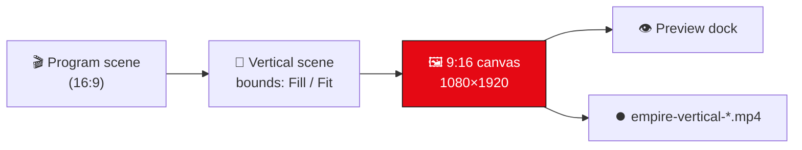

# 📱 Vertical 9:16

Record a **vertical 1080×1920 (9:16)** version of your scene — for TikTok, Reels, Shorts and vertical Kick — **alongside** your normal 16:9 output. Empire‑OBS runs a **dedicated 9:16 canvas** that mirrors your program scene live, so you don't have to build a separate layout.

---

## 🅰️ Open the dock

**View → Docks → Empire Vertical 9:16**

A portrait preview appears, mirroring your current **program** scene and following scene switches automatically.

---

## 🖼️ Framing — Fill vs Fit

The toggle button at the top of the dock chooses how the 16:9 program maps into the 9:16 frame:

| Mode | What it does | Best for |
|---|---|---|
| **Fill (crop)** | Scales the program to **cover** the frame, cropping the sides (centre zoom) | Gameplay, face‑cam |
| **Fit (bars)** | Shows the **whole** program with black bars top/bottom | Keeping everything visible |

---

## ⏺️ Record 9:16

Click **Record 9:16** (green) → it turns red **Stop ● REC** and records the vertical canvas.

- Saved to your **OBS recording folder** as `empire-vertical-<timestamp>.mp4`
- **1080×1920**, hardware encoder (NVENC / QuickSync / AMF) when available — x264 fallback — at 12 Mb/s
- Audio comes from your **main audio mix**
- Click again to stop and finalise the file

---

## ⚙️ How it works

The vertical canvas is a **private `obs_canvas`** — no libobs core changes. Its scene holds the program scene as one item scaled with `OBS_BOUNDS_SCALE_OUTER` (Fill) or `_INNER` (Fit). The preview renders the canvas sources directly via `obs_canvas_render` (a private canvas has no core‑composited texture); recording binds a dedicated encoder to the canvas video through `ffmpeg_muxer`.

---

## 🔜 Coming next
- Vertical **RTMP streaming** (not just recording)
- A **dedicated** vertical scene you compose independently (own sources, not just a mirror of the program)
